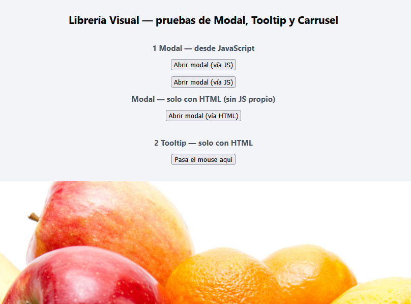
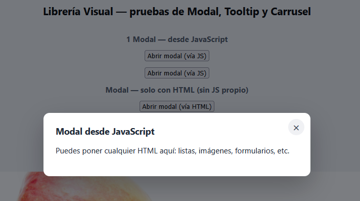
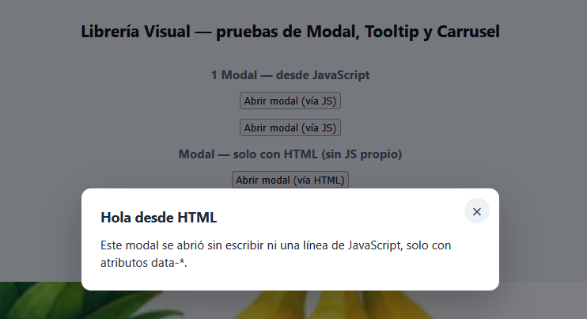
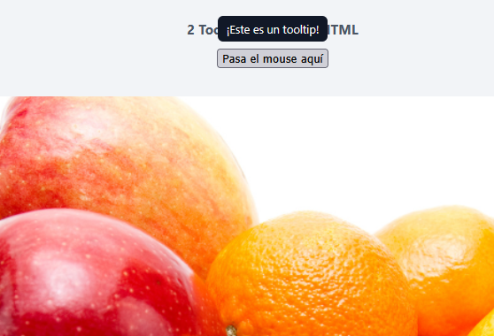

# libreria visual js erick




Librería JavaScript ligera y sin dependencias con 3 componentes visuales listos para usar: **Modal**, **Tooltip** y **Carrusel**.

Pensada para usarse **directamente desde un CDN**, sin instalar nada ni agregar archivos al proyecto: solo un `<link>` y un `<script>`.

## Instalación (vía CDN)

Agrega esto en el `<head>` (o antes de cerrar `</body>`) de tu HTML:

```html
<link rel="stylesheet" href="https://cdn.jsdelivr.net/gh/ErickOmar4/Componente_Visual@main/css/libreriaV.css">
<script src="https://cdn.jsdelivr.net/gh/ErickOmar4/Componente_Visual@main/js/librerIaV.js"></script>
```


Eso es todo. No hay que instalar nada con npm ni copiar archivos: todo se carga desde el CDN.

## Componentes

Cada componente se puede usar de **dos formas**: escribiendo una línea de JavaScript, o solo con atributos `data-*` en el HTML (sin JS propio).

### 1 Modal

**Desde JavaScript:**

```html
<button id="miBoton">Abrir modal</button>


<script>
  document.getElementById('miBoton').addEventListener('click', function () {
    UIKit.modal({
      title: 'Título del modal',
      content: '<p>Puedes poner cualquier HTML aquí.</p>',
      onClose: function () {
        console.log('El modal se cerró');
      }
    });
  });
</script>
```

**Solo con HTML:**



```html
<button data-ui-modal data-title="Título" data-content="Contenido del modal">
  Abrir modal
</button>
```

| Opción     | Tipo       | Descripción                                   |
|------------|------------|------------------------------------------------|
| `title`    | string     | Título que se muestra arriba del modal.        |
| `content`  | string     | Contenido HTML o texto del modal.              |
| `onClose`  | función    | Se ejecuta cuando el usuario cierra el modal.  |

El modal se cierra con la "X", haciendo clic fuera de la caja, o con la tecla `Esc`.

### 2 Tooltip



**Desde JavaScript:**

```html
<button id="ayuda">?</button>

<script>
  UIKit.tooltip('#ayuda', { text: 'Esto es una ayuda', position: 'top' });
</script>
```

**Solo con HTML:**

```html
<button data-ui-tooltip data-text="Esto es una ayuda" data-position="top">?</button>
```

| Opción     | Tipo   | Descripción                                              |
|------------|--------|-----------------------------------------------------------|
| `text`     | string | Texto que se muestra en el tooltip.                       |
| `position` | string | `"top"` (por defecto), `"bottom"`, `"left"` o `"right"`.   |

### 3) Carrusel

**Desde JavaScript:**

```html
<div id="miCarrusel"></div>

<script>
    UIKit.carousel('#miCarrusel', {
    images: [
      'img/frutas1.png',
      'img/frutas2.png',
      'img/frutas3.png'
    ],
    interval: 4000 
  });
</script>
```

**Solo con HTML:**

```html
<div
  data-ui-carousel
  data-images="https://tusitio.com/foto1.jpg, https://tusitio.com/foto2.jpg"
  data-interval="4000">
</div>
```

| Opción      | Tipo       | Descripción                                                      |
|-------------|------------|--------------------------------------------------------------------|
| `images`    | string[]   | Lista de URLs de las imágenes del carrusel.                       |
| `interval`  | número     | Milisegundos entre cambios automáticos. `0` desactiva el avance automatico. |

El carrusel incluye botones de anterior/siguiente, puntos indicadores y pausa el autoplay mientras el mouse está encima.

## Archivos del repositorio

| Archivo             | Para qué sirve                                                        |
|---------------------|-------------------------------------------------------------------------|
| `librerlaV.js`          | Librería completa, comentada y fácil de leer/modificar.                |
| `libreriav.js`      | Misma librería, minificada (recomendada para producción).              |
| `libreriaV.css`         | Estilos de los 3 componentes (no requiere Bootstrap ni ningún framework).|
| `index.html`          | Página de prueba con ejemplos de los 3 componentes.                     |

ejemplo de implentacion index